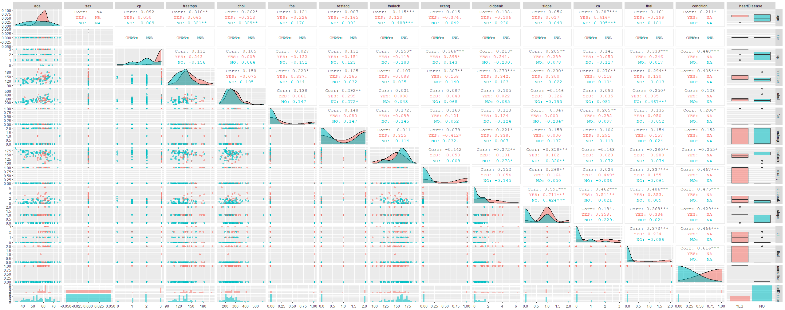

```{r setup, include=FALSE}
knitr::opts_chunk$set(echo = TRUE)
```


# Introducción

En este análisis se va a trabajar con datos de enfermedad cardíaca. 

Estos datos provienen de la basa de datos de Cleveland, que ha sido utilizada en múltiples estudios de machine learning para predecir la enfermedad cardíaca. Los datos se han obtenido de la siguiente URL:

https://www.kaggle.com/cherngs/heart-disease-cleveland-uci


Este dataset contiene 13 atributos que pueden tener influencia sobre la presencia o no de enfermedad cardíaca, así como una columna de tipo factor binario (0/1) que indica si se trata de un paciente con enfermedad cardíaca o sano. 

Las 13 variables o atributos son:

* age: Edad en años
* sex: Hombre/Mujer - Codificada como 0/1 
  + 1: Hombre
  + 0: Mujer
* cp: Tipo de dolor de pecho (0-3) 
  + 0: Angina típica
  + 1: Angina atípica
  + 2: Dolor no asociado a angina
  + 3: asintomático
* trestbps: Presión sanguínea en reposo (mmHg) - Medida al ser admitidos en el hospital
* chol: Colesterol en sangre en mg/dl
* fbs: Azúcar en sangre en ayunas > 120 mg/dl - Codificada como 0/1 (True/False)
* restecg: Resultados del ecg en reposo - escala de 0 a 2
  + 0: Normal
  + 1: Anormalidad en la onda ST-T
  + 2: Muestra una hipertrofia ventricular izquierda probable o definitiva segun el critero de Estes
* thalach: Frecuencia cardíaca máxima alcanzada durante un test con talio
* exang: Angina de pecho inducida por ejercicio - Codificada como 0/1 (True)
* oldpeak: Depresión en la onda ST inducida por ejercicio relativa al reposo
* slope: Pendiente del pico del segmento ST durante el ejercicio
  + 0: Pendiente positiva
  + 1: Pendiente nula
  + 2: Pendiente negativa
* ca: Número de vasos sanguíneos principales coloreados por fluoroscopia
* thal: Resultado del test con talio. 
  + 0: Normal
  + 1: Defecto fijo
  + 2: Defecto reversible

Y la variable de salida/variable respuesta:

* condition: Presencia de enfermedad cardíaca - Codificada como 0/1 (True/False)


## Descripción del análisis

El objetivo es intentar identificar qué variables son mejores predictoras de la enfermedad cardíaca y ajustar un modelo de regresión logística utilizando dichas variables.

# Exploración inicial de los datos

## Importando y limpiando los datos

En primer lugar se importan los datos, se comprueba la presencia de valores NA y atípicos y se hacen gráficos exploratorios para estudiar las variables explicativas.

Importando Librerías

```{r, echo=FALSE, message=FALSE}
library(tidyverse)
library(caret)
library(MLTools)
library(GGally)
library(viridisLite)
```

**Lectura de datos e información preliminar**

```{r}
datos = read_csv("./datos/heart_cleveland_upload.csv")

str(datos)

any(is.na(datos))


```

Hay 297 observaciones de los 13 atributos mencionados previamente y su correspondiente tag (enfermo/sano)

Todas las variables están codificadas como variables de tipo numérico

No faltan valores, probablemente porque es un conjunto de datos ya pre-procesado para Kaggle.

No obstante, conviene mirar si para alguna de las variables hay algún valor no válido según la codificación de cada variable.

```{r}
summary(datos)

```

Con este resumen preliminar ya se puede sacar cierta información relevante para el análisis:

+ La edad media de los sujetos es de 54,5 años. Se puede considerar que la media es representativa, ya que la mediana tiene un valor similar (56 años).

+ Un 67,7% de los sujetos son hombres.

+ Un 46% de los sujetos sufren algún tipo de enfermedad cardíaca.


Para obtener más información sobre la distribución las variables se va a hacer uso de gráficos exploratorios. Dichos gráficos se utilizarán para identificar patrones y responder preguntas sobre los datos.


## Gráficos exploratorios

Transformando la columna condition a un factor, para pintar gráficos con colores según este factor.


```{r}

datos2 = datos %>%
  mutate(heartDisease = factor(condition > 0, 
                            levels = c(TRUE, FALSE), 
                            labels = c("YES", "NO")))

datos2 = datos2 %>%
  dplyr::select(1:15,-c(condition))

```


**EDAD**

```{r}

par(mfrow = c(1, 3))
boxplot(age ~ heartDisease,data = datos2, col= heat.colors(2), 
        cex.axis=0.75, xlab = "Enfermedad Cardíaca")
boxplot(datos2$age,col= "orange", 
        cex.axis=0.75, xlab = "")
stripchart(age ~ heartDisease, data = datos2, method = "jitter",  
	vertical = TRUE, pch = 19, col = "blue", cex=0.3, add = TRUE)
hist(datos2$age,col= "orange", xlab="Edad",main = "", breaks = 20)


ggplot(datos2) +
  geom_histogram(mapping = aes(x= age, fill = heartDisease),
                  color="black",alpha = 0.5) +
  xlab("Edad")


```


Hay valores atípicos de edad si se separan los boxplots en función de la presencia de enfermedad cardíaca, no es así si se consideran todos los datos en conjunto el tramo de edad donde se encuentran el grueso de los sujetos se va de 40 a 70 años.

También parece que la mediana de la edad de sujetos con enfermedad cardíaca es superior a aquellos que no tienen enfermedad cardíaca. Además, la dispersión es menor para los sujetos con enfermedad cardíaca.

**¿Para qué rango de edad hay una mayor incidencia de enfermedad cardíaca?**

El histograma parece indicar que la incidencia de enfermedad cardíaca es mayor en el tramo de edad entre 55 y 65 años.


**Sexo**

```{r}
ggplot(datos2) +
	geom_bar(mapping = aes(x = sex, fill= heartDisease))+
  xlab("Sexo")
```

**¿Hay más incidencia de enfermedad cardíaca en hombres que en mujeres?**

Se puede observar que la incidencia de enfermedad cardíaca en los sujetos de estudio es mucho mayor en hombres que en mujeres. No obstante hay que ser cauto a la hora de extraer conclusiones, ya que hay más del doble de hombres que de mujeres en este dataset. Esto puede deberse a que los hombres sean más propensos a tener problemas de corazón que las mujeres, o que simplemente haya menos datos de mujeres. La literatura científica indica que probablemente se trate de lo primero, pero no es una conclusión que se pueda extraer a partir de estos datos.

Si se quiere construir un modelo para la predicción de enfermedad cardíaca, habría que considerar segmentar entre hombres y mujeres, pues si se construye un modelo utilizando el género como predictor, es probable que este discrimine a las mujeres y no se detecten muchos casos de enfermedad cardíaca.

**Tipo de dolor de pecho**

```{r}
ggplot(datos2) +
	geom_bar(mapping = aes(x = cp, fill= heartDisease)) +
  xlab("Tipo de dolor de pecho") 


```

En términos absolutos el tipo de dolor de pecho más prevalente es el dolor asintomático (3), seguido del dolor no asociado a angina de pecho (2). El dolor asintomático parece ser también el que se presenta en una mayor proporción de los casos de enfermedad cardíaca.


**Presión sanguínea en reposo**

```{r}


par(mfrow = c(1, 2))
boxplot(trestbps ~ heartDisease,data = datos2, col= heat.colors(2), 
        cex.axis=0.75, xlab = "Enfermedad Cardíaca")
boxplot(datos2$trestbps,col= "orange", 
        cex.axis=0.75, xlab = "")
stripchart(trestbps ~ heartDisease, data = datos2, method = "jitter",  
	vertical = TRUE, pch = 19, col = "blue", cex=0.3, add = TRUE)


ggplot(datos2) +
  geom_density(mapping = aes(x= trestbps, fill = heartDisease),
                  color="black",alpha = 0.5) +
  xlab("Presión sanguínea en reposo")
```


Para la presión sanguínea en reposo se pueden apreciar valores atípicos y una dispersión baja. La curva de densidad tiene forma de campana, con una ligera asimetría a la derecha.

Observando las curvas de densidad, la presión sanguínea no parece ser un buen predictor de enfermedad cardíaca en general. A partir de un valor de 150 mmHg si que se puede apreciar más incidencia de enfermedad cardíaca en proporción a los sujetos sin enfermedad cardíaca.

**Colesterol en sangre**

```{r}

par(mfrow = c(1, 2))
boxplot(chol ~ heartDisease,data = datos2, col= heat.colors(2), 
        cex.axis=0.75, xlab = "Enfermedad Cardíaca")
boxplot(datos2$chol,col= "orange", 
        cex.axis=0.75, xlab = "")
stripchart(chol ~ heartDisease, data = datos2, method = "jitter",  
	vertical = TRUE, pch = 19, col = "blue", cex=0.3, add = TRUE)


ggplot(datos2) +
  geom_density(mapping = aes(x=chol , fill = heartDisease),
                  color="black",alpha = 0.5) +
  xlab("Colesterol en sangre")

```

**¿Hay alguna relación entre el nivel de colesterol y la enfermedad cardíaca?**

No parece haber una gran dispersión en los niveles de colesterol. Tampoco se aprecian diferencias significativas entre los sujetos con enfermedad cardíaca y los sujetos sanos. Por tanto este no parece ser un factor especialmente determinante para la presencia de enfermedad cardíaca.


**Azúcar en sangre en ayunas > 120 mg/dl**

```{r}

ggplot(datos2) +
	geom_bar(mapping = aes(x = fbs, fill= heartDisease)) +
  xlab("Azúcar en sangre en ayunas > 120 mg/dl") 

```

El nivel de azúcar en sangre no parece influir tampoco en la incidencia de enfermedad cardíaca. Tanto en los casos en los que el nivel de azúcar en sangre estaba por encima de 120 mg/dl, como en los casos en los que estaba por debajo de dicho nivel, la proporción de sujetos con enfermedad cardíaca y sujetos sanos parece distribuirse de forma similar (aproximadamente 60/40 en ambos casos).


**Resultados del ECG en reposo**
```{r}
ggplot(datos2) +
	geom_bar(mapping = aes(x = restecg, fill= heartDisease)) +
  xlab("Resultados del ECG en reposo") 


```


Los resultados del ECG indican que apenas hay casos en los que se haya apreciado una anormalidad en la onda ST-T (valor = 1). Los resultados se dividen en partes prácticamente iguales entre resultados normales (valor 0) y un resultado que indica una posible hipertrofia ventricular izquierda(valor = 2). En los sujetos que muestran una posible atrofia ventricular izquierda, parece ser que la incidencia de enfermedad cardíaca es proporcionalmente mayor que en el caso de los sujetos con un ECG normal.


**Frecuencia cardíaca máxima alcanzada**

```{r}

par(mfrow = c(1, 3))
boxplot(thalach ~ heartDisease,data = datos2, col= heat.colors(2), 
        cex.axis=0.75, xlab = "Enfermedad Cardíaca")
boxplot(datos2$thalach,col= "orange", 
        cex.axis=0.75, xlab = "")
stripchart(thalach ~ heartDisease, data = datos2, method = "jitter",  
	vertical = TRUE, pch = 19, col = "blue", cex=0.3, add = TRUE)
hist(datos2$thalach,col= "orange", xlab="Frecuencia cardíaca máxima alcanzada",main = "", breaks = 20)


ggplot(datos2) +
  geom_histogram(mapping = aes(x= thalach, fill = heartDisease),
                  color="black",alpha = 0.5) +
  xlab("Frecuencia cardíaca máxima alcanzada")

```


Se puede apreciar como la frecuencia máxima alcanzada durante el test con talio es generalmente menor y presenta más dispersión en el caso de sujetos con enfermedad cardíaca. Por tanto, esta podría ser una buena variable para predecir la enfermedad cardíaca.

Se aprecia algún valor atípico a la izquierda, pero la mayoría de los datos se concentran en el intervalo entre 100 y 200 latidos por minuto.

**Angina de pecho inducida por ejercicio**

```{r}
ggplot(datos2) +
	geom_bar(mapping = aes(x = exang, fill= heartDisease)) +
  xlab("Angina de pecho inducida por ejercicio") 

```


La presencia de una angina de pecho durante el ejercicio parece ser un indicador de enfermedad cardíaca, ya que la incidencia es mucho mayor cuando esta está presente. 


**Depresión en la onda ST inducida por ejercicio-relativa al reposo**

```{r}

par(mfrow = c(1, 2))
boxplot(oldpeak ~ heartDisease,data = datos2, col= heat.colors(2), 
        cex.axis=0.75, xlab = "Enfermedad Cardíaca")
boxplot(datos2$oldpeak,col= "orange", 
        cex.axis=0.75, xlab = "")
stripchart(oldpeak ~ heartDisease, data = datos2, method = "jitter",  
	vertical = TRUE, pch = 19, col = "blue", cex=0.3, add = TRUE)


ggplot(datos2) +
  geom_density(mapping = aes(x=oldpeak , fill = heartDisease),
                  color="black",alpha = 0.5) +
  xlab("Depresión en la onda ST inducida por ejercicio-relativa al reposo")

```


La depresión en la onda ST inducida por ejercicio es claramente mayor en caso de enfermedad cardíaca. Hay algún outlier en la parte superior que quizás convendría eliminar si finalmente se usa esta variable para el modelo de regresión logística. Los casos de personas sin enfermedad cardíaca se concentran mayoritariamente en valores por debajo de 2. 


**Pendiente del pico del segmento ST durante el ejercicio**

```{r}
ggplot(datos2) +
	geom_bar(mapping = aes(x = slope, fill= heartDisease)) +
  xlab("Pendiente del pico segmento ST durante el ejercicio") 
```

Los datos parecen indicar que aquellos sujetos con una pendiente positiva del pico del segmento ST durante el ejercicio (valor = 0) no padecen por lo general de enfermedad cardíaca. Asimismo, aquellos sujetos que presentan una pendiende plana del pico del segmento ST durante el ejercicio.


**Número de vasos sanguíneos principales coloreados por fluoroscopia**

```{r}
ggplot(datos2) +
	geom_bar(mapping = aes(x = ca, fill= heartDisease)) +
  xlab("Número de vasos sanguíneos principales coloreados por fluoroscopia") 
```

En el diagrama de barras se puede apreciar que en los sujetos sanos por lo general no se colorea ningún vaso sanguíneo, aumentando la proporción de individuos con enfermedad cardíaca a medidad que aumenta el número de vasos sanguíneos coloreados.


**Resultado del test con talio**

```{r}
ggplot(datos2) +
	geom_bar(mapping = aes(x = thal, fill= heartDisease)) +
  xlab("Resultado del test con talio") 
```

En el caso del test con talio, aquellos que presentaron un defecto reversible (valor = 2) son los sujetos que mayor incidencia de enfermedad cardíaca tuvieron. Ocurre lo opuesto con aquellos sujetos que obtuvieron un resultado normal en el test con talio, por lo que puede ser un buen predictor de enfermedad cardíaca.

**Enfermedad cardíaca**

```{r}
ggplot(datos2) +
	geom_bar(mapping = aes(x = heartDisease, fill= heartDisease)) +
  xlab("Casos de enfermedad cardíaca") 
```

Se puede apreciar que los casos de enfermedad cardíaca e individuos sanos están relativamente equilibrados en este conjunto de datos. 

No obstante, si se hiciera una segmentación entre hombres y mujeres, las clases no estarían tan equilibradas y habría que considerar hacer un rebalanceo para entrenar el modelo de regresión logística.


## Relaciones entre variables y selección de variables explicativas

Si bien los gráficos anteriores ya mostraban por separado información sobre las variables que pueden ser buenos predictores para la enfermedad cardíaca, se va a hacer uso aquí de las funciones de la librería GGally para ver esas relaciones de forma conjunta.


**NOTA:** Por razones de escala se adjuntan los gráficos como imágenes, aunque se incluye el código utilizado para dibujarlos.


A la vista de este gráfico, no parece que haya una correlación entre las diferentes variables explicativas.


```{r eval=FALSE}
ggpairs(datos2,columns = 1:5, aes(color = heartDisease, alpha = 0.3, progress = FALSE))


PlotDataframe(data.frame(datos2), 
              output.name = "heartDisease")
```


A continuación se van a repetir dichos gráficos segmentados por sexo. Y se comprobará si hay diferencias significativas en cuanto a la relación entre variables y la selección de variables explicativas.


```{r}
hombres = datos2 %>%
  filter(sex == 1)


mujeres = datos2 %>%
  filter(sex == 0)


```

**HOMBRES**

```{r eval=FALSE}
ggpairs(hombres,aes(color = heartDisease, alpha = 0.3, progress = FALSE))


PlotDataframe(data.frame(hombres), 
              output.name = "heartDisease")
```


En el caso del nivel de colesterol, parece que cuando se compara con la muestra que contiene a ambos sexos el nivel de colesterol en hombres resulta ligeramente mejor predictor. Para valores más altos de colesterol parece haber mayor proporción de casos de enfermedad cardíaca. No obstante, sigue sin parecer el mejor predictor de enfermedad cardíaca. Algo similar ocurre con la depresión en la onda ST inducida por ejercicio relativa al reposo.

La frecuencia cardíaca máxima alcanzada durante un test con talio parece ser incluso mejor predictor cuando se mira por separado a los datos de hombres. Algo similar ocurre con el número de vasos sanguíneos coloreados por fluoroscopia y el resultado del test con talio.

En el caso de la angina de pecho observada durante el ejercicio, la proporción de casos de enfermedad cardíaca cuando hay angina de pecho crece sustancialmente al separar los datos de hombres y mujeres.

Para la pendiente del pico del segmento ST durante el ejercicio, aumenta la proporción de enfermos con un valor nulo de la pendiente (valor = 1)


**MUJERES**




```{r eval=FALSE}
ggpairs(mujeres,aes(color = heartDisease, alpha = 0.3, progress = FALSE))


PlotDataframe(data.frame(mujeres), 
              output.name = "heartDisease")
```


Se incluyen los gráficos con el fin de tenerlos como referencia. No obstante, no parece razonable sacar conclusiones a partir de ellos, ya que el número de muestras de sujetos con enfermedad cardíaca es realmente bajo. 


# Modelo de regresión logística

Se va a ajustar únicamente un modelo para hombres, ya que para mujeres hay pocos casos de enfermedad cardíaca, siendo los datos de mujeres pocos de por si. Por ello considero que harían falta más datos de mujeres para entrenar un buen modelo.


## Balance de clases

El siguiente ajuste a plantear es si sería necesario hacer un rebalanceo de clases para entrenar el modelo. En este caso no parece necesario hacer dicho balance, ya que en ambas clases están relativamente equilibradas y el número de muestras no es especialmente grande, por lo que la pérdida de información no compensa los potenciales beneficios de equilibrar las clases. (Todo esto suponiendo que se hiciera un downscaling)


## Selección de variables explicativas para el modelo

La idea es lograr el modelo más sencillo posible (con menor número de variables), que me permita maximizar la sensibilidad (TP/(TP+FN)). Es decir, quiero detectar el mayor número posible de casos de enfermedad cardíaca, aunque algunos de los positivos sean en realidad individuos sanos.


En base al análisis exploratorio inicial parece que las variables más explicativas (no necesariamente en orden) son :

* El tipo de dolor de pecho
* El número de vasos sanguíneos principales coloreados por fluoroscopia
* El resultado del test con talio
* La frecuencia cardíaca máxima alcanzada durante un test con talio
* La depresión en la onda ST inducida por ejercicio relativa al reposo

La estrategia a seguir consistirá en ajustar un modelo preliminar utilizando todas las variables de entrada y comprobar cuáles parece que son efectivamente más relevantes. Posteriormente se tratará de simplificar el modelo al máximo, reduciendo el número de variables explicativas al mínimo.

Se adjunta una captura del p-valor de cada una de las variables


## Modelo Preliminar
```{r}

hombres = hombres %>%
  dplyr::select(1:14,-c(sex))

modelo = train(form = heartDisease ~ ., 
                   data = hombres,                
                   method = "glm",                   
                   preProcess = c("center","scale"), 
                   metric = "Accuracy")              
modelo         
summary(modelo) 
str(modelo)  


```


## Modelo simplificado

A la vista de los resultados obtenidos en el modelo preliminar, parece que finalmente la depresión en la onda ST inducida por ejercicio relativa al reposo no es un factor tan relevante como inicialmente se había supuesto,

Se van a evaluar dos modelos:

* Modelo A: Usando 2 variables explicativas - El número de vasos coloreados y el resultado del test con talio
* Modelo B: Las del modelo A más el tipo de dolor de pecho y la frecuencia cardíaca máxima alcanzada. 


## Separación Test Set - Training Set

Se van a separar los datos entre datos de entrenamiento y de prueba a razón de 80/20

```{r}

set.seed(2020) #Para poder replicar los resultados

heartIndex = createDataPartition(hombres$heartDisease,      
                                  p = 0.8,      
                                  list = FALSE, 
                                  times = 1)    

fTR = hombres[heartIndex,]
fTS = hombres[-heartIndex,]

```

## Entrenamiento del modelo -- Usando k-fold cross validation

A continuación se va a entrenar el modelo utilizando validación cruzada para prevenir un sobreajuste del modelo.

```{r}

ctrl = trainControl(method = "cv",                        
                     number = 10,                         
                     summaryFunction = defaultSummary,     
                     classProbs = TRUE)                    

set.seed(2020) 

modelo1 = train(form = heartDisease ~ ca + thal, 
                   data = fTR,               
                   method = "glm",                   
                   preProcess = c("center","scale"), 
                   trControl = ctrl,                 
                   metric = "Accuracy")              
modelo1          
summary(modelo1) 
str(modelo1)     


```


## Evaluación del modelo

A la hora de construir el modelo, ¿qué es lo que se quiere maximizar?

Se quieren detectar todos los casos de enfermedad cardíaca posibles, aunque se cuelen algunos sujetos que en realidad estén sanos. Por tanto, la medida de rendimiento a maximizar es la sensibilidad (TP/(TP/FN))


```{r}
fTR_eval = fTR
fTS_eval = fTS

fTR_eval$LRprob = predict(modelo1, type="prob", newdata = fTR) # predict probabilities
fTR_eval$LRpred = predict(modelo1, type="raw", newdata = fTR) # predict classes 
#test
fTS_eval$LRprob = predict(modelo1, type="prob", newdata = fTS) # predict probabilities
fTS_eval$LRpred = predict(modelo1, type="raw", newdata = fTS) # predict classes 


```


```{r}
#######confusion matrices
# Training
confusionMatrix(data = fTR_eval$LRpred, #Predicted classes
                reference = fTR_eval$heartDisease, #Real observations
                positive = "YES") #Class labeled as Positive
# test
confusionMatrix(fTS_eval$LRpred, 
                fTS_eval$heartDisease, 
                positive = "YES")

#######Classification performance plots 
# Training
PlotClassPerformance(fTR_eval$heartDisease,       #Real observations
                     fTR_eval$LRprob,  #predicted probabilities
                     selClass = "YES") #Class to be analyzed
# test
PlotClassPerformance(fTS_eval$heartDisease,       #Real observations
                     fTS_eval$LRprob,  #predicted probabilities
                     selClass = "YES") #Class to be analyzed)


```


El modelo con 4 variables explicativas da los mejores resultados a nivel general entre todas las métricas.

El modelo con 4 variables tiene una sensibilidad de 77,27% y un Kappa de 0,53 frente al Kappa de 0,36 del modelo de dos variables. 

Ninguno de los dos modelos es especialmente bueno, pero si se quiere maximizar la sensibilidad es preferible utilizar el modelo con 2 variables (Modelo A).

En el caso de usar todas las variables para el modelo, la sensibilidad es incluso menor, se está metiendo ruido innecesario al modelo que dificulta la predicción que se quiere hacer.


Se adjuntan los resultados de las métricas de rendimiento de los modelos usando 4 variables y usando todas las variables.


# Conclusiones

Los datos muestran que el sexo es un factor relevante para la enfermedad cardíaca, por ello se ha segmentado el análisis, centrándose el modelo de predicción en los hombres debido a la escasez de datos para mujeres.

En base a los resultados obtenidos, parece que los mejores predictores de enfermedad cardíaca son 

* El tipo de dolor de pecho
* El número de vasos sanguíneos principales coloreados por fluoroscopia
* El resultado del test con talio
* La frecuencia cardíaca máxima alcanzada durante un test con talio

En cuanto a la construcción del modelo, se ha podido apreciar el compromiso entre obtener un mejor modelo a nivel global u obtener un mejor modelo en base a la sensibilidad. Se ha de ajustar el modelo en base al objetivo que se persigue, que en este caso era la detección del mayor número de casos posibles, lográndose una tasa del 81,8%.

Cabe señalar que este dataset contiene datos de sujetos que han sido admitidos en el hospital, por tanto parece sensato pensar que debe ser más probable que padezcan algún tipo de afección cardíaca. Sería interesante tomar muestras de estas variables en un conjunto de sujetos aleatorios para ver qué tal generaliza este modelo.


